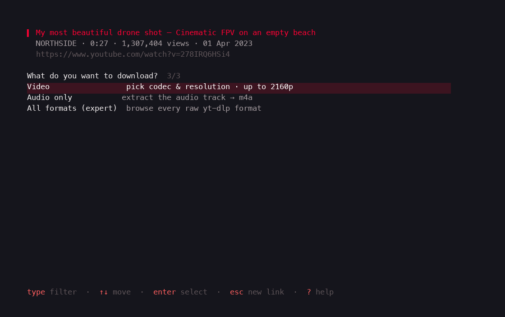
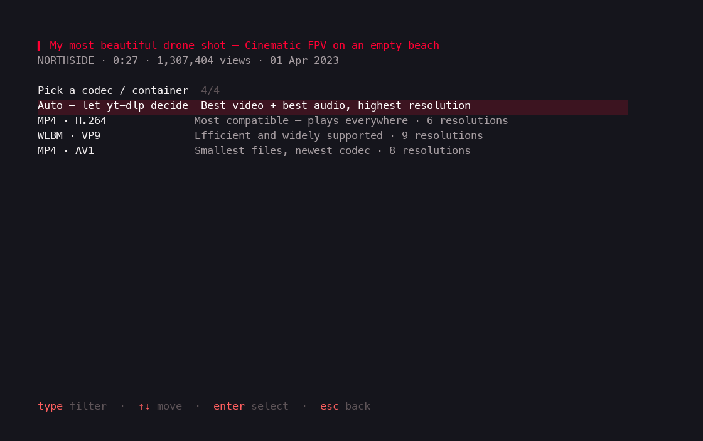
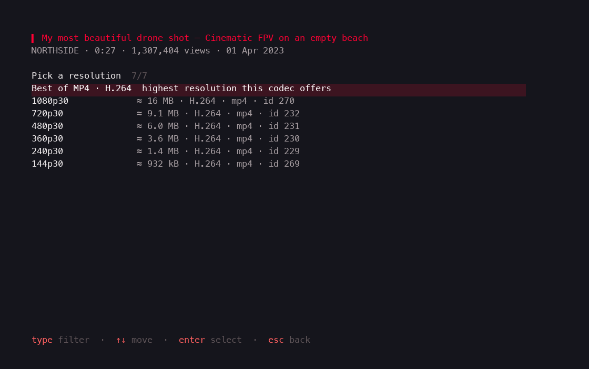
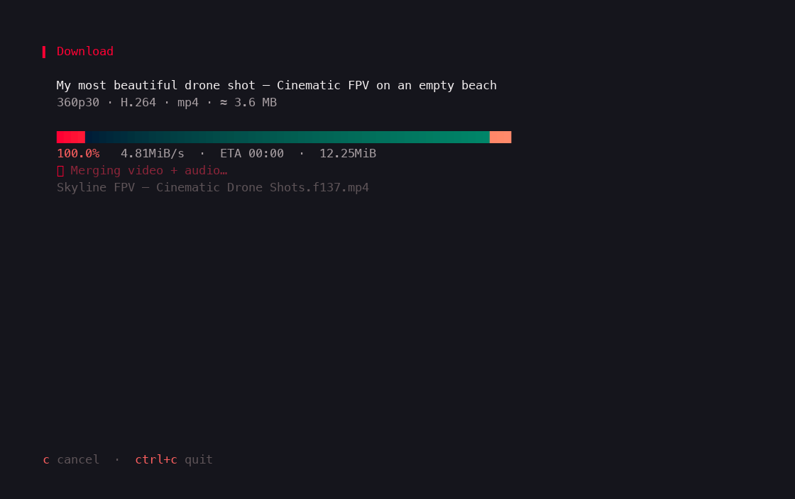

# ytdl-tui

A keyboard-driven terminal UI for **yt-dlp**. Paste a link, fuzzy-pick what
you want, watch it download.

| | |
|---|---|
|  |  |
|  |  |

## Install

Requires [Go](https://go.dev/dl/), [yt-dlp](https://github.com/yt-dlp/yt-dlp#installation)
and [ffmpeg](https://ffmpeg.org) on your `PATH`.

```sh
go install github.com/thalha-dev/ytdl-tui@latest
```

or build from source:

```sh
git clone https://github.com/thalha-dev/ytdl-tui
cd ytdl-tui && make install
```

Works on macOS, Linux and Windows. Run `ytdl-tui --config ./my.yaml` to use a
custom config, `--version` to print the version.

## Usage

Paste any video or playlist URL and press `enter`. ytdl-tui probes it with
yt-dlp and walks you through the options — every list is filtered by the real
[fzf](https://github.com/junegunn/fzf) algorithm, so typing narrows exactly
like the fzf CLI.

- **Video** → codec (H.264 / VP9 / AV1 / Auto) → resolution with estimated
  file sizes → download
- **Audio only** → bitrate/codec → download (converts to your audio format)
- **Expert** → pick from every raw yt-dlp format
- **Playlists** → download everything, audio-only everything, or multi-select
  entries with `tab`

While a download runs you get a live progress bar, speed, ETA and a per-item
count for playlists; `c c` cancels, `o` opens the folder afterwards.

### Keys

| Key | Action |
|---|---|
| `type` | fuzzy-filter the list |
| `↑↓` / `ctrl+k` / `ctrl+j` | move |
| `tab` / `ctrl+a` | toggle entry / toggle all (playlists) |
| `enter` / `esc` | select / back |
| `ctrl+s` | settings |
| `c` twice | cancel a running download |
| `?` | help |

## Configuration

Everything is editable in `ctrl+s`. The file (shown per platform below, e.g.
`~/Library/Application Support/ytdl-tui/config.yaml` on macOS,
`~/.config/ytdl-tui/config.yaml` on Linux, `%AppData%\ytdl-tui\config.yaml`
on Windows) is created with defaults on first run:

```yaml
download_dirs:
    - ~/Movies/YouTube
    - ~/Downloads/YouTube
filename_template: '%(title)s [%(id)s].%(ext)s'
merge_format: mp4          # mp4 | mkv | webm
audio_format: m4a          # best | m4a | mp3 | opus | flac | wav | vorbis
playlist_quality: "1080"   # best | 2160 | 1440 | 1080 | 720 | 480 | 360
embed_thumbnail: true
embed_metadata: true
concurrent_fragments: 4    # 1..8
cookies_from_browser: ""
cookies_file: ""
```

### Download folders

Keep up to **five** save locations. With more than one configured, the TUI
asks where to save before every download. Manage the list under settings →
*Download folders* (`a` add, `e` edit, `d` delete). The old single
`download_dir` key still works and migrates automatically.

### YouTube bot-check

If YouTube ever answers with *"Sign in to confirm you're not a bot"*, that's
an IP-reputation thing on YouTube's side — retrying a few minutes later
usually just works. To use your account instead: sign in to YouTube in your
browser, then set **Cookies (browser)** in settings (browsers are
auto-detected, including Firefox forks like Zen) or point **Cookies file**
at an exported `cookies.txt`. Safari needs Full Disk Access for your
terminal.

## Development

```sh
make build    # ./bin/ytdl-tui
make test     # go vet + unit tests
make e2e      # drives the real binary through a PTY (needs network)
```

Scripts/screenshots contains a fake `yt-dlp` + PTY renderer that regenerates
the images in `docs/screenshots` deterministically.

## License

[MIT](LICENSE)
